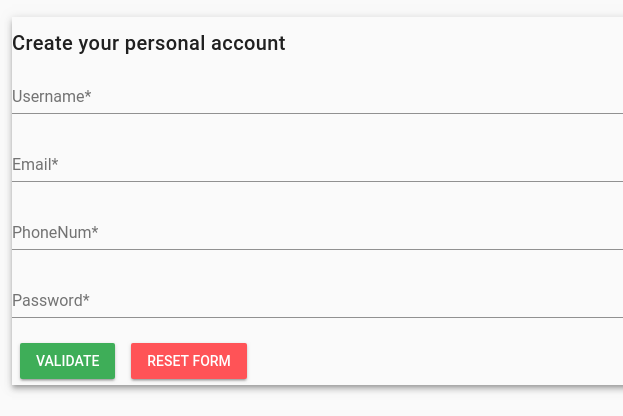
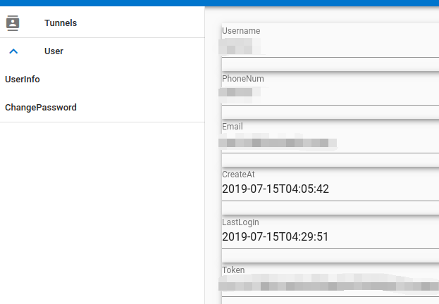
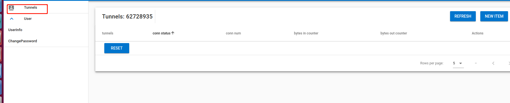

## 使用说明

>
>
>**注册帐号**
>
>>```
>>http://frontend.gitlab:8080/
>>```
>>
>>
>>
>>
>>
>>登录获取token
>>
>>
>>
>>
>>
>>
>
>**下载，配置client**
>
>>```
>>https://github.com/wanglu119/HDoc/tree/master/auth_ngrok
>>
>>wget https://raw.githubusercontent.com/wanglu119/HDoc/master/auth_ngrok/ngrok_new_client
>>
>>添加执行权限:
>>chmod +x ngrok_new_client
>>
>>
>>```
>>
>>
>
>**启动client**
>
>>启动参数:
>>
>>```
>>./ngrok_new_client -h
>>
>>Usage of bin/ngrok_new_client:
>>  -authToken string
>>        auth token, default ''
>>  -cpath string
>>        client config path, default ''
>>  -serAddr string
>>        server address, default '106.13.62.131:3443' (default "106.13.62.131:3443")
>>
>>```
>>
>>启动client
>>
>>```
>>bin/ngrok_new_client -authToken xxxxx
>>```
>>
>>
>>
>>启动client后，在登录`http://frontend.gitlab:8080/`可以创建，穿透通道
>>
>>
>>
>>
>
>


